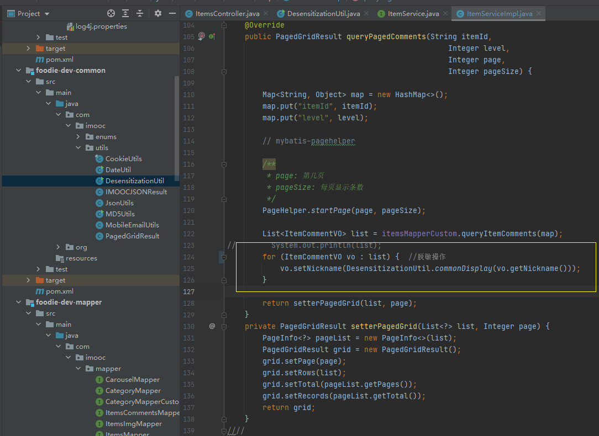

# framework-learn
# 第一阶段

## 第二周 分类，推荐，搜索，评价，购物车开发

* 留意一下，枚举类型。很多地方都用到了。写死的数据都要枚举出来


##### 首页轮播图

* 效果图 

  点击对应的图片可以跳转。

* 代码实现

  * service层先写接口 

* 然后对应的controller  实现创建indexController，实现carousel接口。注意，这里要自己定义一个枚举

##### 首页分类展示需求  

懒加载机制

> 一级分类

​	

* 	
* 代码实现：这里用到了一个懒加载机制。主要是前端实现。后端只要获取所有数据
  * 前面也要自定义mapper。跟下方 懒加载机制实现一样
* service:  
* Controller: 

> 二级分类

* 首先要通过sql建立多表联合查询，sql代码：

``` sql
SELECT
	f.id as id,
	f.`name` as `name`,
	f.type as type,
	f.father_id as fatherId,
	c.id as subId,
	f.`name` as subName,
	f.type as subType,
	f.father_id as subFatherId
FROM 
	category f
LEFT JOIN
	category c
on
	f.id = c.father_id
where
	f.father_id = 1

```

* service

  调用了上面的sql。功能就是多表联合查询一下，然后将元素返回出来。懒加载机制主要是在前端完成

* controller

  ``` java
      @ApiOperation(value = "获取商品子分类", notes = "获取商品子分类", httpMethod = "GET")
      @GetMapping("/subCat/{rootCatId}")
      public IMOOCJSONResult subCat(
              @ApiParam(name = "rootCatId", value = "一级分类id", required = true)
              @PathVariable Integer rootCatId) {
  
          if (rootCatId == null) {
              return IMOOCJSONResult.errorMsg("分类不存在");
          }
  
          List<CategoryVO> list = categoryService.getSubCatList(rootCatId);
          return IMOOCJSONResult.ok(list);
      }
  ```

  

  

  

  
  
  
  
  
  
  
  
  
  
  
###### 配置自定义mapper

1. 先创建mapper，直接创建接口就行 
2. 配置xml文件，绑定并且写sql 

 ##### 下拉懒加载

下方具体的展示随着鼠标下拉，懒加载，进行展示。

* 多表关联查询的sql:

``` sql
SELECT
f.id as rootCatId,
f.`name` as rootCatName,
f.slogan as slogan,
f.cat_image as catImage,
f.bg_color as bgColor,
i.id as itmeId,
i.item_name as itemName,
ii.url as itemUrl,
i.created_time as createdTime
FROM
	category f
LEFT JOIN
	items i
ON
	f.id = i.root_cat_id
LEFT JOIN
	items_img ii
ON
	i.id = ii.item_id
WHERE
	f.type= 1
AND
	i.root_cat_id = 7
AND
	ii.is_main= 1
ORDER BY
	i.created_time
DESC
LIMIT 0,6
```


* 自定义Mapper

  

  xml文件配置：

  ```xml
      <resultMap id="myNewItemsVO" type="com.imooc.pojo.vo.NewItemsVO">
          <id column="rootCatId" property="rootCatId"/>
          <result column="rootCatName" property="rootCatName"/>
          <result column="slogan" property="slogan"/>
          <result column="catImage" property="catImage"/>
          <result column="bgColor" property="bgColor"/>
  
          <collection property="simpleItemList" ofType="com.imooc.pojo.vo.SimpleItemVO">
              <id column="itemId" property="itemId"/>
              <result column="itemName" property="itemName"/>
              <result column="itemUrl" property="itemUrl"/>
          </collection>
      </resultMap>
  
      <select id="getSixNewItemsLazy" resultMap="myNewItemsVO" parameterType="Map">
          SELECT
              f.id as rootCatId,
              f.`name` as rootCatName,
              f.slogan as slogan,
              f.cat_image as catImage,
              f.bg_color as bgColor,
              i.id as itemId,
              i.item_name as itemName,
              ii.url as itemUrl,
              i.created_time as createdTime
          FROM
              category f
          LEFT JOIN items i ON f.id = i.root_cat_id
          LEFT JOIN items_img ii ON i.id = ii.item_id
          WHERE
              f.type = 1
          AND
              i.root_cat_id = #{paramsMap.rootCatId}
          AND
              ii.is_main = 1
          ORDER BY
              i.created_time
          DESC
          LIMIT 0,6
      </select>
  
  ```

  * 添加vo：

  ``` java
  public class NewItemsVO {
  
      private Integer rootCatId;
      private String rootCatName;
      private String slogan;
      private String catImage;
      private String bgColor;
  
      private List<SimpleItemVO> simpleItemList;}  
  //省略get与set方法
  ```

  

* service

  接口：   

  ```java
      /**
       * 查询首页每个一级分类下的6条最新商品数据
       * @param rootCatId
       * @return
       */
      public List<NewItemsVO> getSixNewItemsLazy(Integer rootCatId);
  
  }
  ```

  实现：

  ```java
      @Transactional(propagation = Propagation.SUPPORTS)
      @Override
      public List<NewItemsVO> getSixNewItemsLazy(Integer rootCatId) {
          Map<String, Object> map = new HashMap<>();
          map.put("rootCatId", rootCatId);
          return categoryMapperCustom.getSixNewItemsLazy(map);
      }
  ```

* controller:

  ``` java
      @ApiOperation(value = "查询每个一级分类下的最新6条商品数据", notes = "查询每个一级分类下的最新6条商品数据", httpMethod = "GET")
      @GetMapping("/sixNewItems/{rootCatId}")
      public IMOOCJSONResult sixNewItems(
              @ApiParam(name = "rootCatId", value = "一级分类id", required = true)
              @PathVariable Integer rootCatId) {
  
          if (rootCatId == null) {
              return IMOOCJSONResult.errorMsg("分类不存在");
          }
  
          List<NewItemsVO> list = categoryService.getSixNewItemsLazy(rootCatId);
          return IMOOCJSONResult.ok(list);
      }
  ```

## 搜索 

### 商品详情页

* 效果：

  可以展示出图片价格，口味选项等信息

* 代码实现：

  * controller层 ItemsController: 

  ```java
  @ApiOperation(value = "查询商品详情", notes = "查询商品详情", httpMethod = "GET")
      @GetMapping("/info/{itemId}")
      public IMOOCJSONResult info(
              @ApiParam(name = "itemId", value = "商品id", required = true)
              @PathVariable String itemId) {
  
          if (StringUtils.isBlank(itemId)) {
              return IMOOCJSONResult.errorMsg(null);
          }
  
          Items item = itemService.queryItemById(itemId);
          List<ItemsImg> itemImgList = itemService.queryItemImgList(itemId);
          List<ItemsSpec> itemsSpecList = itemService.queryItemSpecList(itemId);
          ItemsParam itemsParam = itemService.queryItemParam(itemId);
                  //这里有四个要传递的参数，但是json每次只能传递一个，因此要借助VO
          ItemInfoVO itemInfoVO = new ItemInfoVO();
          itemInfoVO.setItem(item);
          itemInfoVO.setItemImgList(itemImgList);
          itemInfoVO.setItemSpecList(itemsSpecList);
          itemInfoVO.setItemParams(itemsParam);
          return IMOOCJSONResult.ok(itemInfoVO);
      }
  ```

  service层代码就是查询，这里忽略。

  

#### 商品评价展示并且实现分页

商品展示也涉及到多表的连接查询，要自定义sql。  
* ItemsMapperCustom：

```java
 public List<ItemCommentVO> queryItemComments(@Param("paramsMap") Map<String, Object> map);
```

* xml实现：

```xml
  <select id="queryItemComments" parameterType="Map" resultType="com.imooc.pojo.vo.ItemCommentVO">
    SELECT
        ic.comment_level as commentLevel,
        ic.content as content,
        ic.sepc_name as specName,
        ic.created_time as createdTime,
        u.face as userFace,
        u.nickname as nickname
    FROM
        items_comments ic
    LEFT JOIN
        users u
    ON
        ic.user_id = u.id
    WHERE
        ic.item_id = #{paramsMap.itemId}
        <if test=" paramsMap.level != null and paramsMap.level != '' ">
          AND ic.comment_level = #{paramsMap.level}
        </if>
  </select>

```

对比一下和前面的下拉懒加载的xml实现，为何这里没有<resultMap>?

  因为这里的resultType是直接从pojo中定义了，所以上面不需要再定义<resultMap> 。所以，这里的数据全是放在了VO中的

* service层实现

###### 分页使用mybatis分页插件.
 使用分页插件是在service中使用。

PageHelper.startPage(page, pageSize);

```xml
        <dependency>
            <groupId>com.github.pagehelper</groupId>
            <artifactId>pagehelper-spring-boot-starter</artifactId>
            <version>1.2.12</version>
        </dependency>
```

* 配置yml文件

```yaml
# 分页插件配置
pagehelper:
  helperDialect: mysql
  supportMethodsArguments: true
```


* 先来编写service:

``` java
  @Transactional(propagation = Propagation.SUPPORTS)
    @Override
    public PagedGridResult queryPagedComments(String itemId,
                                                  Integer level,
                                                  Integer page,
                                                  Integer pageSize) {

        Map<String, Object> map = new HashMap<>();
        map.put("itemId", itemId);
        map.put("level", level);

        // mybatis-pagehelper

        /**
         * page: 第几页
         * pageSize: 每页显示条数
         */
        PageHelper.startPage(page, pageSize);

        List<ItemCommentVO> list = itemsMapperCustom.queryItemComments(map);
//        System.out.println(list);
        for (ItemCommentVO vo : list) {
            vo.setNickname(DesensitizationUtil.commonDisplay(vo.getNickname()));
        }

        return setterPagedGrid(list, page);
    }
    private PagedGridResult setterPagedGrid(List<?> list, Integer page) {
        PageInfo<?> pageList = new PageInfo<>(list);
        PagedGridResult grid = new PagedGridResult();
        grid.setPage(page);
        grid.setRows(list);
        grid.setTotal(pageList.getPages());
        grid.setRecords(pageList.getTotal());
        return grid;
    }
```
* 为分页设置一个数据格式：

```java
	public class PagedGridResult {
	
	private int page;			// 当前页数
	private int total;			// 总页数	
	private long records;		// 总记录数
	private List<?> rows;		// 每行显示的内容
	}  //省略set与get方法
```

* 控制层
```java

 @ApiOperation(value = "查询商品评论", notes = "查询商品评论", httpMethod = "GET")
    @GetMapping("/comments")
    public IMOOCJSONResult comments(
            @ApiParam(name = "itemId", value = "商品id", required = true)
            @RequestParam String itemId,
            @ApiParam(name = "level", value = "评价等级", required = false)
            @RequestParam(required = false) Integer level,
            @ApiParam(name = "page", value = "查询下一页的第几页", required = false)
            @RequestParam Integer page,
            @ApiParam(name = "pageSize", value = "分页的每一页显示的条数", required = false)
            @RequestParam Integer pageSize) {

        if (StringUtils.isBlank(itemId)) {
            return IMOOCJSONResult.errorMsg(null);
        }
        if (page == null) {
            page = 1;
        }
        if (pageSize == null) {
            pageSize = COMMON_PAGE_SIZE;  //这里通用化一些，COMMON这个统一放一起
        }
        System.out.println(level);
        PagedGridResult grid = itemService.queryPagedComments(itemId,
                                                                level,
                                                                page,
                                                                pageSize);
        return IMOOCJSONResult.ok(grid);
    }
```

##### 注意坑

查询全部评论时，level应该是为空，但是会返回空白页面。这里设置参数  **required=false** 来解决。表示level为非必须参数。

#### 信息匿名脱敏

* 效果：


实现：引入工具类

```java

/**
 * 通用脱敏工具类
 * 可用于：
 *      用户名
 *      手机号
 *      邮箱
 *      地址等
 */
public class DesensitizationUtil {

    private static final int SIZE = 6;
    private static final String SYMBOL = "*";

    public static void main(String[] args) {
        String name = commonDisplay("慕课网");
        String mobile = commonDisplay("13900000000");
        String mail = commonDisplay("admin@imooc.com");
        String address = commonDisplay("北京大运河东路888号");

        System.out.println(name);
        System.out.println(mobile);
        System.out.println(mail);
        System.out.println(address);
    }

    /**
     * 通用脱敏方法
     * @param value
     * @return
     */
    public static String commonDisplay(String value) {
        if (null == value || "".equals(value)) {
            return value;
        }
        int len = value.length();
        int pamaone = len / 2;
        int pamatwo = pamaone - 1;
        int pamathree = len % 2;
        StringBuilder stringBuilder = new StringBuilder();
        if (len <= 2) {
            if (pamathree == 1) {
                return SYMBOL;
            }
            stringBuilder.append(SYMBOL);
            stringBuilder.append(value.charAt(len - 1));
        } else {
            if (pamatwo <= 0) {
                stringBuilder.append(value.substring(0, 1));
                stringBuilder.append(SYMBOL);
                stringBuilder.append(value.substring(len - 1, len));

            } else if (pamatwo >= SIZE / 2 && SIZE + 1 != len) {
                int pamafive = (len - SIZE) / 2;
                stringBuilder.append(value.substring(0, pamafive));
                for (int i = 0; i < SIZE; i++) {
                    stringBuilder.append(SYMBOL);
                }
                if ((pamathree == 0 && SIZE / 2 == 0) || (pamathree != 0 && SIZE % 2 != 0)) {
                    stringBuilder.append(value.substring(len - pamafive, len));
                } else {
                    stringBuilder.append(value.substring(len - (pamafive + 1), len));
                }
            } else {
                int pamafour = len - 2;
                stringBuilder.append(value.substring(0, 1));
                for (int i = 0; i < pamafour; i++) {
                    stringBuilder.append(SYMBOL);
                }
                stringBuilder.append(value.substring(len - 1, len));
            }
        }
        return stringBuilder.toString();
    }

}
```

然后在service层使用：

#### 商品搜索

效果：点击搜索可以得到数据。并且三个排序点击都有相应结果拿到

* 编写多表联合查询sql（这个sql要研究一下）
* 编写自定义mapper，xml。这里注意这个的写法：
	AND i.item_name like '%${paramsMap.keywords}%'

* 创建VO
* service层编写
* controller层编写

#### 分类搜索

步骤与上面基本相同

### 购物车

购物车的存储形式：**Cookie**

* 无需登录，无需查库，保存在浏览器端
* 有点：性能好、访问快，没有和数据库交互
* 缺点1：换电脑购物车数据会丢失
* 缺点2：电脑被其他人登陆时，隐私安全

购物车存储形式：**session**

* 用户登录后，购物车数据存放入用户会话
* 优点：初期性能好，访问快
* 缺点1：session基于内存，用户量庞大影响服务器性能
* 缺点2：只能存在当前会话，不适合集群式分布系统 

购物车存储形式： **数据库**

* 用户登录后，购物车数据存入数据库
* 优点：数据持久化，任何地方，时间可以访问
* 缺点：频繁读写数据库，造成数据库压力

购物车存储形式： **Redis**

* 用户登录后，购物车数据存入redis缓存
* 优点1：数据持久化，和在任何地点任何时间访问
* 优点2：频繁读写只基于缓存，不会造成数据库压力
* 优点3：适用于集群和分布式系统，可扩展性强

采取形式：cookie+redis形式

#### 首先采用cookie实现

##### 添加购物车功能

* 先创建一个ShopcatController.写入相关方法
* 为传入的对象创建一个BO
* 编写添加购物车方法，路由为  **/add** 

##### 购物车渲染

* 首先编写自定义sql

* 创建mapper，编写自定义ItemsMapperCustom.xml.  queryItemsBySpecIds

* 创建ShopcartVO

  ​	注意xml中字符串拼接的用法.open,separator,close

  ```xml
  <foreach collection="paramsList" index="index" item="specId" open="(" separator="," close=")">
                #{specId}
              </foreach>
  ```

* 编写ItemServiceImpl

* 编写ItemsController  接口**/refresh**  

##### 添加购物收货地址

内容似乎没了，代码里面自己看一下

##### 确认订单


订单确认只要编写OrdersController即可。方法为 create 方法

##### 创建订单

* OrderService层，先实现createOrder，拿到所有信息，并且写入BO。（涉及的表有很多，有几百行，这里要细分析）
  * 扣除商品库存方法（ItemServiceImpl中  decreaseItemSpecStock方法），存在一个资源共享的不一致问题。采用**分布式事务锁** 处理（后续）。这里先采用**乐观锁**

```xml
    <update id="decreaseItemSpecStock">

        update
            items_spec
        set
            stock = stock - #{pendingCounts}
        where
            id = #{specId}
        and
            stock >= #{pendingCounts}

    </update>
```

##### 微信支付

申请支付功能需要企业资质才可以，个人不行。

异步通知支付结果

* OrdersController  notifyMerchantOrderPaid方法
* OrderService  updateOrderStatus方法
* 支付中心的代码直接部署在线上的（已经提供，foodie-payment 这个工程）
* restTemplate的使用    (这里要填找老师申请才能有)
* 注意，这里为了方便测试，所有金额全修改为1分钱。在OrderController 58行

* 知识点，内网穿透 内网放在公网上   natapp.cn这个网站
* 支付完成后页面跳转  轮询支付成功结果